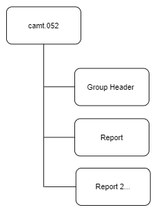

# camt.052 message

> This message is sent by the account servicer to an account owner or to a party authorised by the account owner to receive the message. It can be used to inform the account owner, or authorised party, of the entries reported to the account, and/or to provide the owner with balance information on the account at a given point in time.

:::info

It can contain reports for more than one account. It provides information for cash management and/or reconciliation.

It can be used to:

- report pending and booked items;
- provide balance information.

:::

:::info

Corresponds to MT941/942

:::

## Structure

Report section will be repeated for different accounts

## Entry Status

:::info

Entry(Ntry) - Status(Sts) - Code(Cd) tag will provide the status of the entry

:::

| Code | Name        | Definition                                                                                                                                 |
| ---- | ----------- | ------------------------------------------------------------------------------------------------------------------------------------------ |
| BOOK | Booked      | Booked means that the transfer of money has been completed between account servicer and account owner.                                     |
| FUTR | Future      | Entry is on the books of the account servicer and value will be applied to the account owner at a future date and time.                    |
| INFO | Information | Entry is only provided for information, and no booking on the account owner's account in the account servicer's ledger has been performed. |
| PDNG | Pending     | Booking on the account owner's account in the account servicer's ledger has not been completed                                             |

## Message Flow

