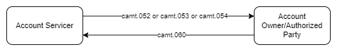

# camt.053 message

> This message is sent by the account servicer to an account owner or to a party authorised by the account owner to receive the message. It is used to inform the account owner, or authorised party, of the entries booked to the account, and to provide the owner with balance information on the account at a given point in time.

:::info

- It can contain reports for more than one account.
- It provides information for cash management and/or reconciliation.
- It contains information on booked entries only.
- It provides information on items that have been booked to the account and also balance information.
- Depending on services and schedule agreed between banks and their customers, statements may be generated and exchanged accordingly, for example for intraday or prior day periods.

:::

:::info

Corresponds to MT940/950

:::

## Structure

Statement section will be repeated for different accounts

## Message Flow

