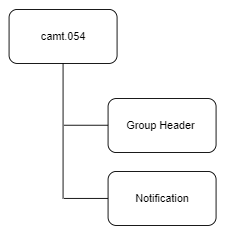
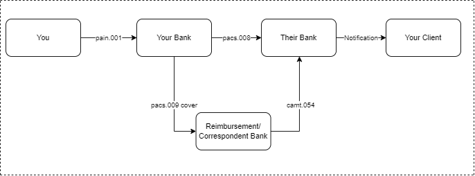
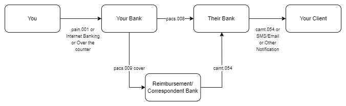

# camt.054 message

> This message is sent by the account servicer to an account owner or to a party authorised by the account owner to receive the message. It can be used to inform the account owner, or authorised party, of single or multiple debit and/or credit entries reported to the account.

camt.054 is the debit/credit notification sent to the account owner whenever a transaction happens on that account.

:::info
It can be used to

- report pending and booked items
- notify one or more debit entries
- notify one or more credit entries
- notify a combination of debit and credit entries

:::

:::caution

It does not contain balance information

:::

:::info

Corresponds to MT900/910

:::

## Structure

## Entry Status

:::info

Entry(Ntry) - Status(Sts) - Code(Cd) tag will provide the status of the entry

:::

| Code | Name        | Definition                                                                                                                                 |
| ---- | ----------- | ------------------------------------------------------------------------------------------------------------------------------------------ |
| BOOK | Booked      | Booked means that the transfer of money has been completed between account servicer and account owner.                                     |
| FUTR | Future      | Entry is on the books of the account servicer and value will be applied to the account owner at a future date and time.                    |
| INFO | Information | Entry is only provided for information, and no booking on the account owner's account in the account servicer's ledger has been performed. |
| PDNG | Pending     | Booking on the account owner's account in the account servicer's ledger has not been completed                                             |

## Message Flow

## Examples

### Notification from a correspondent

### Notification from a correspondent as well as creditor agent

This is possible if the account owner (Your client) has capability to receive camt.054

