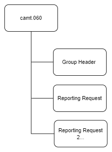

# camt.060 message

> The AccountReportingRequest message is sent by the account owner, either directly or through a forwarding agent, to one of its account servicing institutions. It is used to ask the account servicing institution to send a report on the account owner's account in a Bank To Customer Account Report (camt.052), a Bank To Customer Statement (camt.053) or a Bank To Customer Debit Credit Notification (camt.054).

## Structure

## Message Flow

