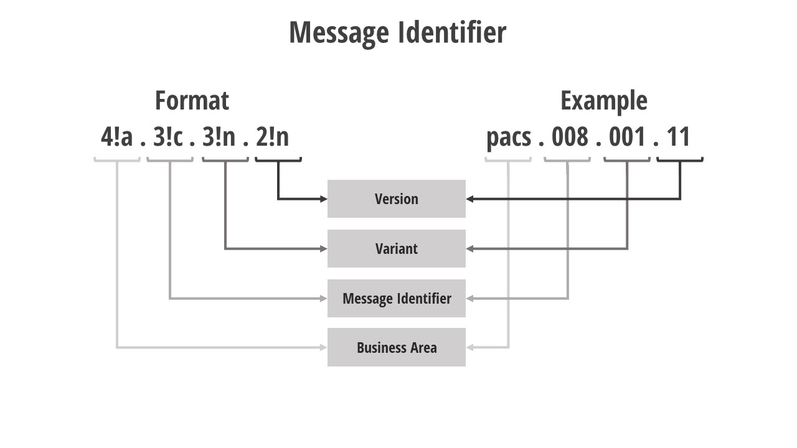
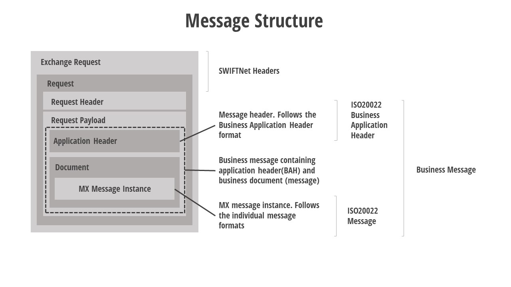

# Message Details

## Identification

The messages are identified using the format [4!a.3!c.3!n.2!n].

- The first set (4 alphabets) represent the business area
- The second set (3 characters) identifies the type of message
- The third set (3 numbers) represent the variant. A 'variant' is a restricted version of a message and may exclude portions of the message that are rarely used.
- The fourth set (2 numbers) represent the version of the message and the variant.

## Structure

The important part of the complete payload transferred is highlighted as a dashed line. This contains the applicaiton header information and the MX message. The application header follows the business applciaiton header format("head" definition) while the message follows the individual message definitions such as pacs, pain, camt etc. The definitions including the header definition are available in the [ISO20022 message definitions](https://www.iso20022.org/iso-20022-message-definitions) set.

## Character sets

- Data type text is restricted to - **a-z A-Z 0-9 / - ? : ( ) . , ' + .**
- Special characters are allowed in all party name and addressed, related remittance information, remittance information - **^^!#&%\*=^\_’{|}~";@[\]**
- **$ > <** are allowed in email adress elements
