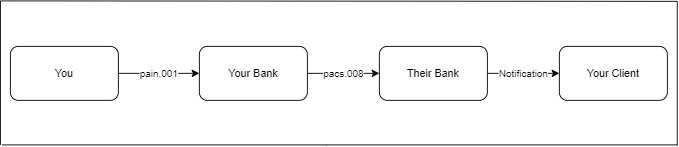
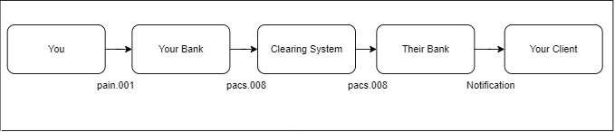
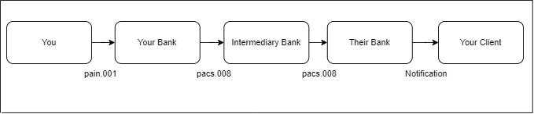

# Reference Numbers

There are two types of reference numbers used in a payment transaction. There are multiple reference numbers involved in a single transaction.

| ID                         | Tag        | Type           | Assigned By             |
| -------------------------- | ---------- | -------------- | ----------------------- |
| Instruction Identification | InstrId    | Point to Point | Instructing party       |
| Message Identification     | MsgId      | Point to Point | Instructing party       |
| End To End Identification  | EndToEndId | End to End     | Initiating party        |
| Transaction Identification | TxId       | End to End     | First instructing agent |
| UETR                       | UETR       | End to End     | First instructing agent |
| Clearing System Reference  | ClrSysRef  | End to End     | Clearing system         |

## Point to Point

### Instruction Identification

**Definition:** Unique identification, as assigned by an instructing party for an instructed party, to
unambiguously identify the instruction.

**Usage:** The instruction identification is a point to point reference that can be used between the
instructing party and the instructed party to refer to the individual instruction. It can be included in
several messages related to the instruction.

### Message Identification

**Definition:** Point to point reference, as assigned by the instructing party, and sent to the next party in the
chain to unambiguously identify the message.

**Usage:** The instructing party has to make sure that MessageIdentification is unique per instructed party
for a pre-agreed period.

## End To End Identification

**Definition:** Unique identification, as assigned by the initiating party, to unambiguously identify the
transaction. This identification is passed on, unchanged, throughout the entire end-to-end chain.

**Usage:** The end-to-end identification can be used for reconciliation or to link tasks relating to the
transaction. It can be included in several messages related to the transaction.

### Transaction Identification

**Definition:** Unique identification, as assigned by the first instructing agent, to unambiguously identify the
transaction that is passed on, unchanged, throughout the entire interbank chain.

**Usage:** The transaction identification can be used for reconciliation, tracking or to link tasks relating to
the transaction on the interbank level.

### UETR

**Definition:** Universally unique identifier to provide an end-to-end reference of a payment transaction.

This is mainly used in SWIFT and can uniquely identify a transaction from any Bank within the SWIFT network. This uses UUID v4.

### Clearing System Reference

**Definition:** Unique reference, as assigned by a clearing system, to unambiguously identify the instruction.

## Examples

Reference numbers assigned for some of the message flows are listed below

### Correspondents

| ID                         | Assigned By                                              |
| -------------------------- | -------------------------------------------------------- |
| Instruction Identification | Your Bank (Creator of this message)                      |
| Message Identification     | Your Bank (Creator of this message)                      |
| End To End Identification  | You (Initiating Party - pain.001 creator)                |
| Transaction Identification | Your Bank (First instructing agent in the payment chain) |
| UETR                       | Your Bank (First instructing agent in the payment chain) |
| Clearing System Reference  | N/A (No Clearing System Involved)                        |

### Clearing System

| ID                         | Assigned By                                              |
| -------------------------- | -------------------------------------------------------- |
| Instruction Identification | Your Bank (Creator of this message)                      |
| Message Identification     | Your Bank (Creator of this message)                      |
| End To End Identification  | You (Initiating Party - pain.001 creator)                |
| Transaction Identification | Your Bank (First instructing agent in the payment chain) |
| UETR                       | Your Bank (First instructing agent in the payment chain) |
| Clearing System Reference  | Clearing System                                          |

### Serial Flow

#### First pacs.008

| ID                         | Assigned By                                              |
| -------------------------- | -------------------------------------------------------- |
| Instruction Identification | Your Bank (Creator of this message)                      |
| Message Identification     | Your Bank (Creator of this message)                      |
| End To End Identification  | You (Initiating Party - pain.001 creator)                |
| Transaction Identification | Your Bank (First instructing agent in the payment chain) |
| UETR                       | Your Bank (First instructing agent in the payment chain) |
| Clearing System Reference  | N/A (No Clearing System Involved)                        |

#### Second pacs.008

| ID                         | Assigned By                                              |
| -------------------------- | -------------------------------------------------------- |
| Instruction Identification | Intermediary Bank (Creator of this message)              |
| Message Identification     | Intermediary Bank (Creator of this message)              |
| End To End Identification  | You (Initiating Party - pain.001 creator)                |
| Transaction Identification | Your Bank (First instructing agent in the payment chain) |
| UETR                       | Your Bank (First instructing agent in the payment chain) |
| Clearing System Reference  | N/A (No Clearing System Involved)                        |
