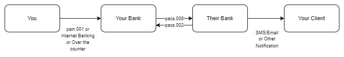

# pacs.002 message

> The FIToFIPaymentStatusReport message is sent by an instructed agent to the previous party in the payment chain. It is used to inform this party about the positive or negative status of an instruction (either single or file). It is also used to report on a pending instruction.

pacs.002 reports the status of the payment instruction(pacs.008 or pacs.009). Status can be reported at the transaction group level and at the individual transaction level.

## Group Status

| Field                     | Tag       | Type                              |
| ------------------------- | --------- | --------------------------------- |
| Group Status              | GrpSts    | Status of a group of transactions |
| Status Reason Information | StsRsnInf | Detailed Status Information       |

## Transaction Status

| Field                     | Tag       | Type                        |
| ------------------------- | --------- | --------------------------- |
| Group Status              | TxSts     | Status of a transaction     |
| Status Reason Information | StsRsnInf | Detailed Status Information |

:::info

If Status Reason/Code is equal to NARR(Narrative), then AddititionalInformation must be present.

:::

## Status could indicate any of the below

- Positive - Payment accepted and settled
- Negative - Payment rejected
- Pending - Payment is under process. This could be due to payment on hold for screening or any other reasons

