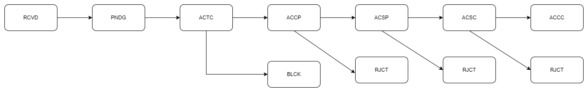
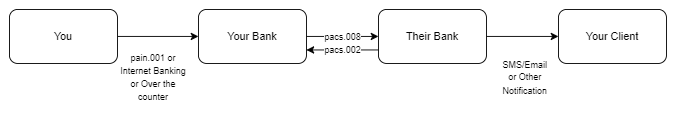
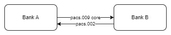

# pacs.002 message

> The FIToFIPaymentStatusReport message is sent by an instructed agent to the previous party in the payment chain. It is used to inform this party about the positive or negative status of an instruction (either single or file). It is also used to report on a pending instruction.

pacs.002 reports the status of the payment instruction(pacs.008 or pacs.009).

:::info

There is no dedicated FIN equivalent of the pacs.002 message. To perform a return for the MT103 or MT202, an agent would return the original message to the sender, unchanged, using a return code in Field 72

:::

## Payment Status

Status could indicate any of the below

- Positive - Payment accepted and settled
- Negative - Payment rejected
- Pending - Payment is under process. This could be due to payment on hold for screening or any other reasons

:::caution

pacs.002 is mandatory and has to be sent by instructed agent to instructing agent in case of rejection (Negative). Positive and Pending status reporting are not mandatory.

:::

## Status Fields

Status can be reported at the transaction group level and at the individual transaction level.

### Group Status

| Field                     | Tag       | Type                              |
| ------------------------- | --------- | --------------------------------- |
| Group Status              | GrpSts    | Status of a group of transactions |
| Status Reason Information | StsRsnInf | Detailed Status Information       |

### Transaction Status

| Field                     | Tag       | Type                        |
| ------------------------- | --------- | --------------------------- |
| Group Status              | TxSts     | Status of a transaction     |
| Status Reason Information | StsRsnInf | Detailed Status Information |

:::info

If Status Reason/Code is equal to NARR(Narrative), then AddititionalInformation must be present.

:::

## Important Statuses

| Value | Name                                       | Description                                                                                                                                                                                                                                                                                                                                                               |
| ----- | ------------------------------------------ | ------------------------------------------------------------------------------------------------------------------------------------------------------------------------------------------------------------------------------------------------------------------------------------------------------------------------------------------------------------------------- |
| RCVD  | Received                                   | Payment initiation has been received by the receiving agent.                                                                                                                                                                                                                                                                                                              |
| PDNG  | Pending                                    | Payment initiation or individual transaction included in the payment initiation is pending. Further checks and status update will be performed.                                                                                                                                                                                                                           |
| ACTC  | AcceptedTechnicalValidation                | Authentication and syntactical and semantical validation are successful.                                                                                                                                                                                                                                                                                                  |
| BLCK  | Blocked                                    | Payment transaction previously reported with status 'ACWP' is blocked, for example, funds will neither be posted to the Creditor's account, nor be returned to the Debtor.                                                                                                                                                                                                |
| ACCP  | AcceptedCustomerProfile                    | Preceding check of technical validation was successful. Customer profile check was also successful.                                                                                                                                                                                                                                                                       |
| ACSP  | AcceptedSettlementInProcess                | All preceding checks such as technical validation and customer profile were successful and therefore the payment initiation has been accepted for execution.                                                                                                                                                                                                              |
| ACSC  | AcceptedSettlementCompletedDebitorAccount  | Settlement completed. Usage : this can be used by a Market Infrastructure reporting to Infrastructure Participant or an Account Servicer to Account Owner to report that the transaction account entry has been completed. Warning : this status is provided for transaction status reasons, not for financial information. It can only be used after bilateral agreement |
| ACCC  | AcceptedSettlementCompletedCreditorAccount | Settlement on the creditor's account has been completed.                                                                                                                                                                                                                                                                                                                  |
| RJCT  | Rejected                                   | Payment initiation or individual transaction included in the payment initiation has been rejected.                                                                                                                                                                                                                                                                        |

## Status Workflow

Example of a simple message status workflow

## Message Flow

### pacs.002 for pacs.008

### pacs.002 for pacs.009

