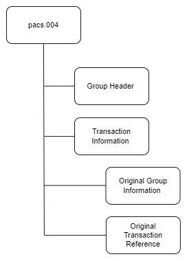
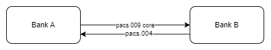
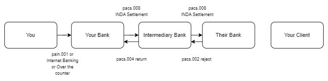
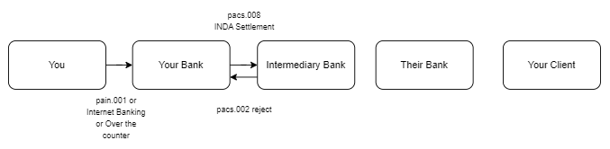
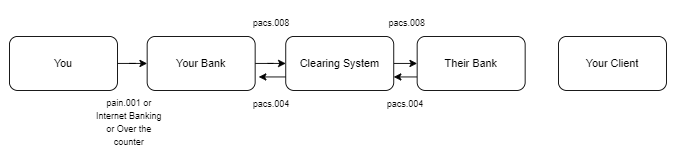
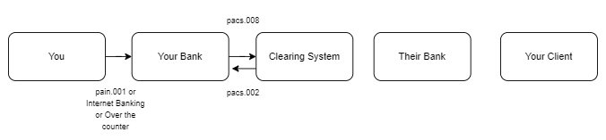

# pacs.004 message

> The Payment Return message is sent by an instructed agent to the previous party in the payment chain when a payment cannot be executed due to an administrative reason (for example non existing/closed account) or banking reason (for example insufficient funds).

pacs.004 message is sent by an instructed agent to the previous party where the payment instruction has already been settled, or when there is a problem processing it further on in the payment chain.

:::info

There is no dedicated FIN equivalent of the pacs.004 message. To perform a return for the MT103 or MT202, an agent would return the original message to the sender, unchanged, using a return code in Field 72

:::

# Structure

The pacs.004 Return Payment message has amongst other elements Original Group Information which captures original information such as the Original UETR and Original Interbank Settlement Amount etc. and an Original Transaction Reference which contain the key elements of the original payment e.g. Debtor, Creditor etc.

## Message Flow

:::info

pacs.004 is sent for INGA settlement method (instructing agent settlement) as the instructing agent has already settled the amount.

pacs.002 is sent for INDA settlement method (instructed agent settlement) as the instructed agent has not yet settled the amount.

:::

### pacs.004 for pacs.008

### pacs.004 for pacs.009

### pacs.004 for serial payment

#### pacs.004 for serial payment - 1

- Second pacs.008 is rejected as the settlement is not yet complete
- First pacs.008 is returned as the settlement is complete

#### pacs.004 for serial payment - 2

- Second pacs.008 is returned as the settlement is complete(INGA settlement method)
- First pacs.008 is returned as the settlement is complete

#### pacs.004 for serial payment - 3

- First pacs.008 is rejected as the settlement is not yet complete

### pacs.004 in clearing

:::info

pacs.002 can only be sent by clearing system/market infrastrucute. Destination bank can only send pacs.004 as the the clearing system has already settled the amount in their books. Destination bank cannot send pacs.002.

:::

#### pacs.004 for clearing system - 1

#### pacs.002 for clearing system - 2

