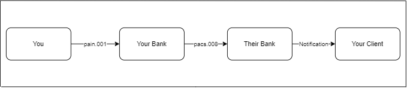
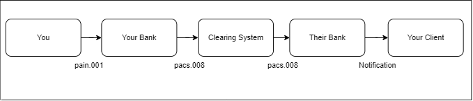

# pacs.008 message

> Financial Institution To Financial Institution Customer Credit Transfer message is the inter-bank movement of an amount from a party bank account (the debtor account) to a beneficiary party (the creditor). Financial Institution To Financial Institution Customer Credit Transfer messages result in one or more cash transfers between debtors and creditors through correspondent banks or infrastructures. They may be exchanged as single or grouped instructions following certain common characteristics and, for convenience or efficiency reasons, exchanged in a batch mode. The processing of credit transfers may differ from country to country and system to system.

pacs.008 will be sent if you as a customer request your bank to do a funds transfer to an account in another bank.

:::info

- You may go to the branch and request a transfer over the counter or
- You may request a payment through internet or mobile banking
- You being a corporate may have your own ERP system and that is integrated with the banks system and can request the payment through a pain.001 (payments initiation) message or
- You can request a payment through some propreitary integration with the bank that doesnt involve pain.001

The above will result in an outgoing pacs.008 from your bank

:::

## Structure

## Message flow where your bank and their bank are correspondents

## Message flow where your bank and their bank are not direct correspondents and settled through cover payment

## Message flow where the messages are routed through intermediary banks (serial flow)

## Message flow through a clearing system

