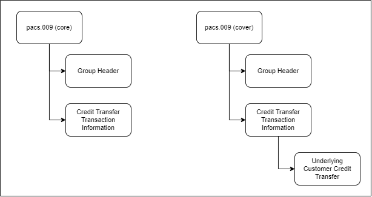
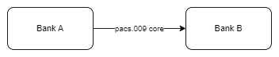

# pacs.009 message

> Financial Institution Credit Transfer message is the inter-bank movement of an amount from a party bank account (the debtor) to a beneficiary party (the creditor) where all parties are financial institutions. Financial Institution Credit Transfer messages result in cash transfers between debtors and creditors through correspondent banks or infrastructures. They may be exchanged as single instructions or grouped following certain common characteristics and, for convenience or efficiency reasons, exchanged in a batch mode. The processing of credit transfers may differ from country to country and system to system.

pacs.009 is used to transfer funds from one bank to another bank.

:::info

pacs.009 has two main use cases

- Core - Financial Institution to Financial Institution Credit Transfer
- Cover - Cover of pacs.008 message

:::

## Structure

:::info

The pacs.009 cover message contains information of the underlying Customer Credit Transfer (pacs.008).
This is the key attribute to differentiate between the core and cover use cases.

:::

## When is core payment used?

Any Bank to Bank contracts or transactions such as

- Bank A has agreed to a foreign exchange deal with Bank B or
- Bank A has agreed to a money market deal with Bank B

## When is cover payment used?

Suppose you want to transfer 1000 USD from your account in Bank A(Your Bank) to your client account in Bank B(Their Bank) as part of invoice settlement.

- You have an account in Bank A (Your Bank)
- Your client has an account in Bank B (Their Bank)
- Bank A and Bank B **does not** have an account relationship. They are not correspondents.
- But Bank A has an account relationship with Bank C (Reimbursement/Correspondent Bank)
- Similarly, Bank B has an account relationship with Bank C (Reimbursement/Correspondent Bank)

In this case,

- Bank A will send pacs.008 creadit transfer instruction to Bank B
- Immediately, Bank A will send a pacs.009 cover message to Bank C to instruct them to debit their account and credit the account of Bank B in their books.

:::info

The above cover message is how the funds are moved from Bank A to Bank B if the banks do not have account relationship.

:::

