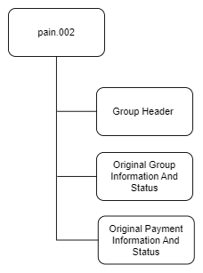

# pain.002 message

> Depending on the service level agreed between the debtor agent and the initiating party, the debtor agent may send a Customer Payment Status Report message to inform the initiating party of the status of the initiation.

:::info

- The message is exchanged between an agent and a non-financial institution customer to provide status information on instructions previously sent.
- Its usage will always be governed by a bilateral agreement between the agent and the non-financial institution customer.
- The message can be used to provide information about the status (for example a rejection, an acceptance) of the initiation of a credit transfer, a direct debit, as well as on the initiation of other customer instructions.
- The message refers to the original instruction(s) by means of references only or by means of references and a set of elements from the original instruction.
- The message can be used in domestic and cross-border scenarios.
- The may also be sent to the receiver of the payment in a real time payment scenario, as both sides of the transactions must be informed of the status of the transaction (that is either the beneficiary is credited, or the transaction is rejected).

:::

## Structure

## Message Flow

### To Initiating Party

### To Beneficiary

